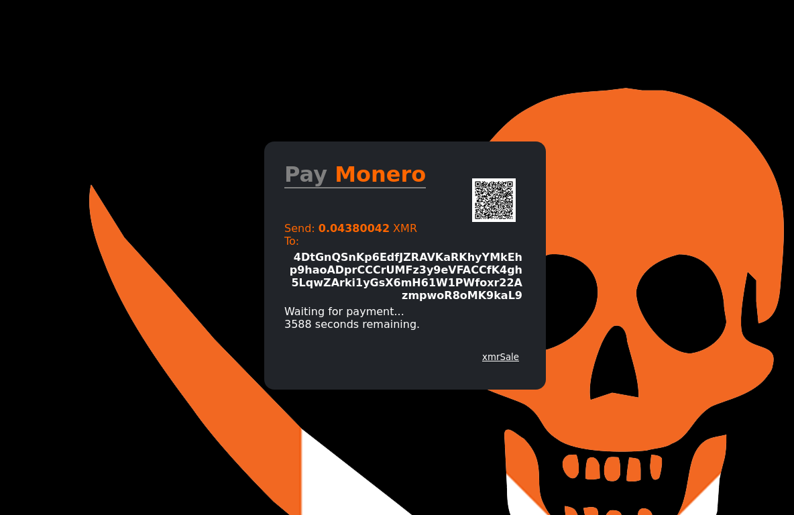

# Home
**xmrSale** is a simple, easily deployable, lightweight Monero payment processor that connects to your own Monero node. A Monero specialized fork of [SatSale](https://github.com/nickfarrow/xmrSale)

Please support [via the Monero Community Crowdfunding System](https://repo.getmonero.org/monero-project/ccs-proposals/-/merge_requests/246).

<iframe src="https://try.xmrsale.org" style="margin: 0 auto;display:block;width:420px;height:460px;border:none;overflow:hidden;" scrolling="no"></iframe>

## [try.xmrsale.org](https://try.xmrsale.org)
<!--  -->
Or check out our Monero webstore demo: [store.xmrsale.org](https://store.xmrsale.org)

**xmrSale is currently under early development, always manually check significant payments**.

## [try.xmrsale.org](https://try.xmrsale.org)

xmrSale is a self-hosted Monero payment processor, serving two primary use cases:
1. Donation button for your website that you can easily embed/link to anywhere.
2. Monero payment gateway, including a Woocommerce plugin that easily turns ANY Wordpress site into a Monero accepting store.

xmrSale makes donation buttons simple - easy copy paste the one line HTML iframe into your site. With a simple Python backend to talk to your own Monero node, xmrSale uses RPC to generate new addresses, and monitors the payment status with your own copy of the blockchain.

# Features
* You don't need your own node, xmrSale sets up `monero-wallet-rpc` and connects to public nodes (can be over tor!)
* Lightweight and highly extendable, basic html and css stying. Modular Python backend, take a [look at the code](xmrsale.py).
* Natively extendable to all Monerod node features (e.g. segwit) through RPC.
* QR codes, customizable required payment confirmations and payment expiry time.
* Privacy ensured. Monero only.

## Contributions
See the [Github](https://github.com/xmrsale/xmrSale/). Pull requests welcome.

## Disclaimer
xmrSale is in very early development. As such, we are not responsible for any loss of funds, vulnerabilities with software, or any other grievances which may arise. Always confirm large payments manually.

## Support
Thank you for your continued support on the Monero Community Crowdfunding System (CCS). You can also support the [satSale](https://satsale.org) project as we relied on it heavily as a code base.
