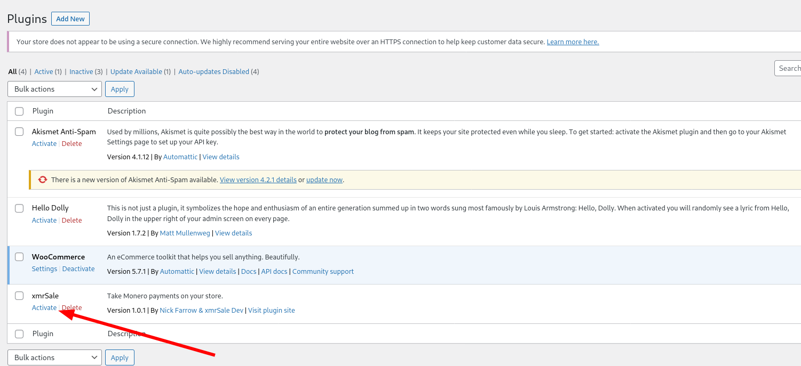
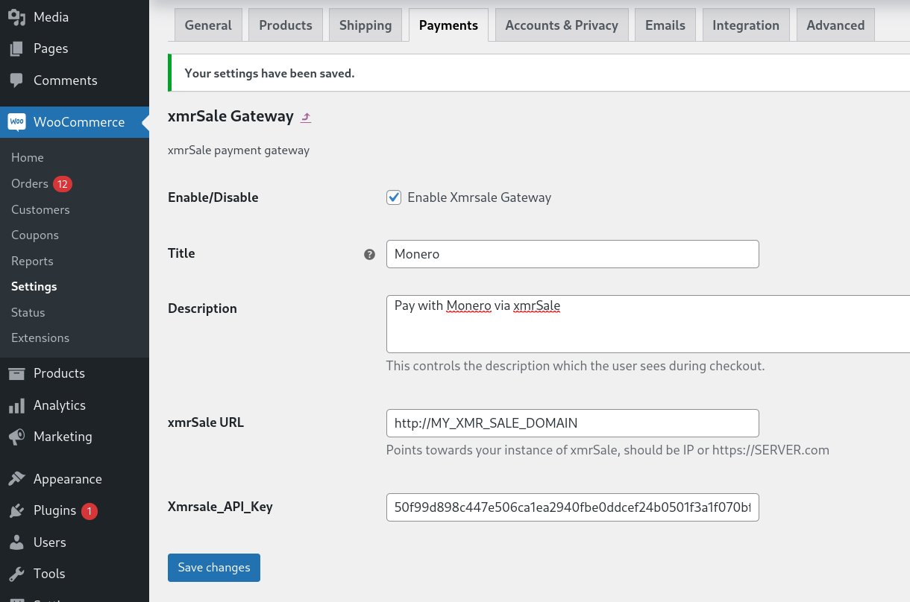
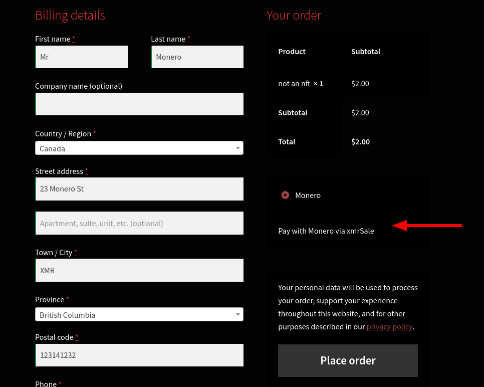

# Woocommerce Payment Gateway
To install the woocommerce payment gateway plugin, first copy [/gateways/woo_xmrsale.php](https://github.com/xmrsale/xmrSale/blob/master/gateways/woo_xmrsale.php) to your Wordpress site in `wp-content/plugins/`.

Next, in your Wordpress admin area, go to the plugins section and activate xmrSale. Then go to the Woocommerce settings and the "Payments" tab. Enable xmrSale as a payment gateway.

Click 'Set Up'/'Manage' and fill out the required fields and point towards your xmrSale instance. You will need to copy the contents of `xmrSale/xmrSale_API_key` into your API key field. This is generated after running xmrSale for the first time.

Now you should be able to view xmrSale as an option in your checkout:

That's it! Please reach out if there are some further features you desire in this plugin.
